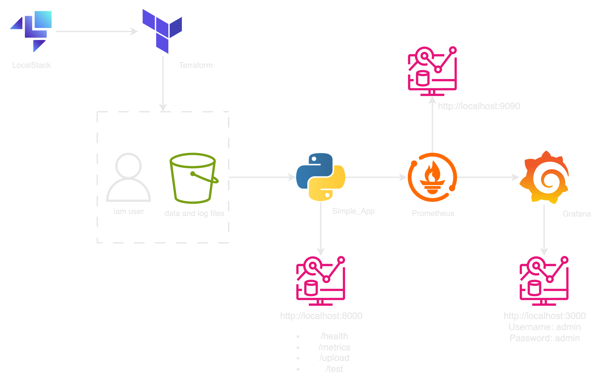
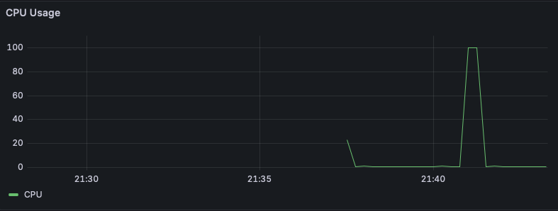
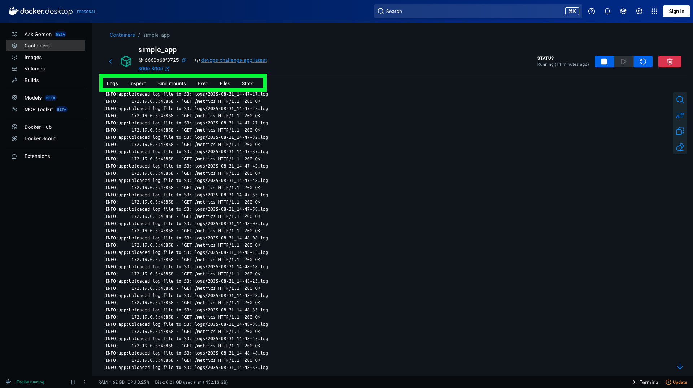

# devops-challenge
This project is about running AWS LocalStack, Simple Application and Monitoring System by using Docker Compose.

## Architecture

As in the above diagram, the docker compose start with LocalStack to prepare the aws resource locally then Terraform will be run to create IAM User and S3 bucket, Next the Simple_App will be built on docker and start the service. After that Prometheus come to collect the metrics data of the app via /metrics endpoint. Finally, all of metrics data were sent to Grafana to represent on the prepared dashboards.

## Prerequisites
Docker version 28.3.2 or later : [Install Docker](https://www.docker.com/get-started/) <br>
Docker Compose version v2.39.1 (Included with Docker Desktop by default)

## Start Project
Start this project with steps as follows:
  1. Clone the repository
  ```bash
  git clone https://github.com/AkkachaiCE/devops-challenge.git
  ```

  2. Go to directory
  ```bash
  cd devops-challenge
  ```

  3. Run docker compose in detached mode
  ```bash
  docker compose up -d
  ```

  4. Stop docker compose and remove volumes
  ```bash
  docker compose down -v
  ```

## API Documentation
There are 4 API endpoints in this project as follows:
### /health
```bash
http://localhost:8000/health
```
To check the status of the Simple_app, we can use curl command as below
```bash
curl http://localhost:8000/health

return:

{"status":"ok","timestamp":"2025-08-31T13:19:03.039734+00:00","app":{"name":"Simple_App","version":"1.0.0"}}
```
### /metrics
This endpoint will return metrics data for the Simple_app which is the same endpoint for Prometheus
```bash
http://localhost:8000/metrics
```
Example:
```bash
# HELP process_cpu_seconds_total Total user and system CPU time spent in seconds.
# TYPE process_cpu_seconds_total counter
process_cpu_seconds_total 0.75
# HELP process_open_fds Number of open file descriptors.
# TYPE process_open_fds gauge
process_open_fds 12.0
# HELP process_max_fds Maximum number of open file descriptors.
# TYPE process_max_fds gauge
process_max_fds 1.048576e+06
# HELP log_lines_total Total number of log lines
# TYPE log_lines_total counter
log_lines_total 12.0
# HELP log_lines_created Total number of log lines
# TYPE log_lines_created gauge
log_lines_created 1.7566510359162283e+09
# HELP file_uploads_total Total number of uploaded files
# TYPE file_uploads_total counter
# HELP s3_total_objects Total number of objects in S3 bucket
# TYPE s3_total_objects gauge
s3_total_objects 0.0
# HELP s3_total_size_bytes Total size of S3 bucket in bytes
# TYPE s3_total_size_bytes gauge
s3_total_size_bytes 0.0
# HELP cpu_usage_percent CPU usage percent
# TYPE cpu_usage_percent gauge
cpu_usage_percent 0.8
# HELP memory_usage_percent Memory usage percent
# TYPE memory_usage_percent gauge
memory_usage_percent 13.2
# HELP disk_read_bytes Disk read bytes
# TYPE disk_read_bytes gauge
disk_read_bytes 7.2178176e+08
# HELP disk_write_bytes Disk write bytes
# TYPE disk_write_bytes gauge
disk_write_bytes 1.31223552e+08
# HELP network_in_bytes Network input bytes
# TYPE network_in_bytes gauge
network_in_bytes 15820.0
# HELP network_out_bytes Network output bytes
# TYPE network_out_bytes gauge
network_out_bytes 48373.0
```
### /upload
This post endpoint can recieve data then put it to the s3 bucket.
```bash
http://localhost:8000/upload
```
Example for putting text file to s3 bucket in LocalStack by using `curl -X POST`
```bash
curl -X POST "http://localhost:8000/upload" -F "file=@text.txt"

return:
{"filename":"files/text.txt","url":"s3://logging-application-082929/files/text.txt"}
```
### /test
This endpoint will run cpu stress for 30 seconds as in example below.

```bash
curl http://localhost:8000/test

return:
CPU stress test started for 30 seconds using 8 processes.
```

## Troubleshooting
Most of the time I did the troubleshoot in the Docker Desktop App because it is easy to check any running container on the Logs, Exec or Files as in the picture below.



### Additional troubleshooting commands:
```bash
- docker compose exec <container-name> sh
- awslocal s3 ls s3://<bucket-name>/files/
- awslocal s3 cp s3://<bucket-name>/logs/log-file-name.log - | cat
- curl http://localhost:4566/_localstack/health | jq | grep -v "disabled"
```
## Comments
The created IAM USER for Simple_App by Terraform was not used to attach to Simple_App because I used the root access_key and secret_key `(.env.example)` in the project. We can implement additional method to export acess_key to environment then attach to Simple_App later.